# NinerLog Frontend — Developer Guide

An in-depth guide to the architecture, conventions, and day-to-day workflows of
the NinerLog frontend. This document is for developers who need to **understand
how the app is wired together**, **change the look and feel**, or **add new
features** (pages, data hooks, forms, components, translations).

> This guide covers the frontend (`ninerlog-frontend`) **only**. The backend API,
> deployment, and infrastructure live in separate repositories and are out of
> scope here. Where the frontend depends on the API, it does so exclusively
> through the auto-generated typed client described in
> [Talking to the API](#5-talking-to-the-api).

## Table of Contents

1. [The Big Picture](#1-the-big-picture)
2. [Tech Stack & Why](#2-tech-stack--why)
3. [Project Layout](#3-project-layout)
4. [Application Bootstrap & Runtime Flow](#4-application-bootstrap--runtime-flow)
5. [Talking to the API](#5-talking-to-the-api)
6. [State Management](#6-state-management)
7. [The Styling System](#7-the-styling-system)
8. [Routing & The App Shell](#8-routing--the-app-shell)
9. [Internationalization (i18n)](#9-internationalization-i18n)
10. [Recipes — Adding New Things](#10-recipes--adding-new-things)
11. [Testing](#11-testing)
12. [Tooling, Quality Gates & Conventions](#12-tooling-quality-gates--conventions)

---

## 1. The Big Picture

NinerLog is a **mobile-first Progressive Web App (PWA)**: an installable,
offline-aware single-page application that behaves like a native app on iOS and
Android home screens while remaining a normal website in the browser.

The frontend is a **pure client** — it holds no business logic that the API
doesn't also enforce. Its job is to render data, validate input before it is
sent, and provide a fast, accessible, multilingual UI.

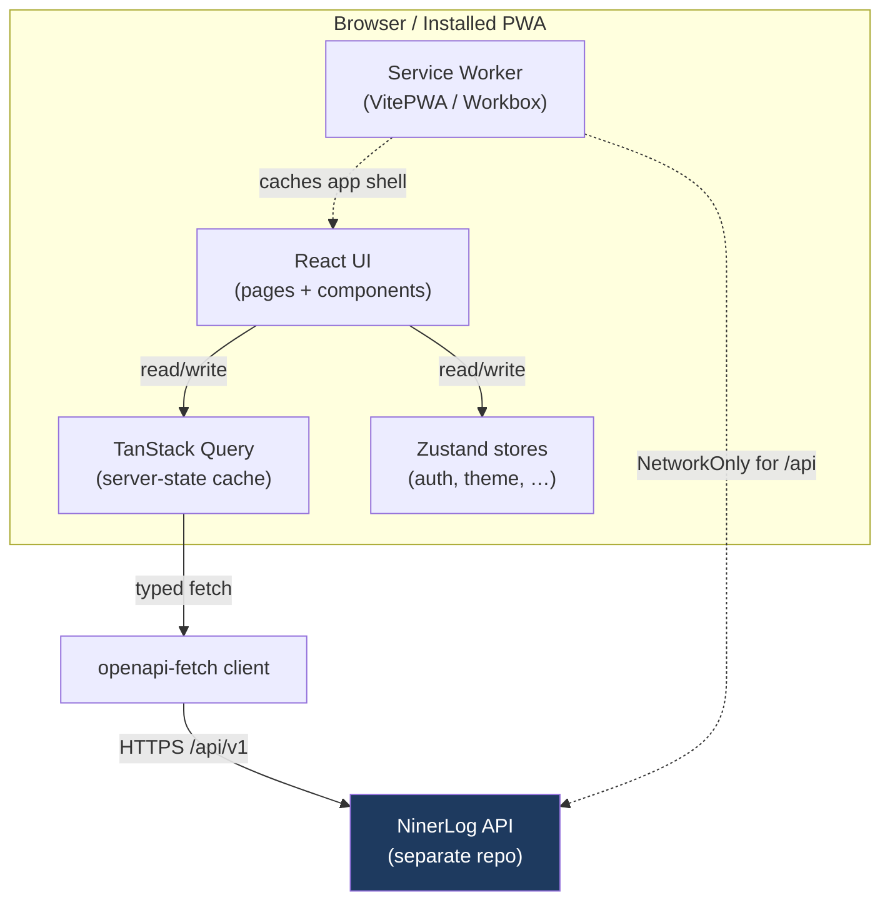

Three ideas drive almost every architectural decision:

| Principle | What it means in practice |
|---|---|
| **API-first** | The backend OpenAPI spec is the source of truth. The API client and all request/response types are **generated**, never hand-written. |
| **Server state ≠ client state** | Anything that lives on the server is owned by **TanStack Query**. Only truly local UI state (auth session, theme, onboarding) lives in **Zustand**. |
| **Design tokens, not ad-hoc CSS** | Colors, spacing, and component classes are defined once in `index.css` as Tailwind v4 tokens and `@layer components` utilities. Components compose these rather than inventing new styles. |

---

## 2. Tech Stack & Why

| Concern | Choice | Notes |
|---|---|---|
| Framework | **React 19** + **TypeScript** | Function components + hooks only. |
| Build tool | **Vite** | Fast dev server, `@` alias → `src/`, code-split production builds. |
| Styling | **Tailwind CSS v4** | Configured **in CSS** (`@theme`) — there is no `tailwind.config.js`. |
| Routing | **React Router v7** | Lazy-loaded route components for code splitting. |
| Server state | **TanStack Query v5** | Caching, refetching, invalidation. |
| Client state | **Zustand v5** | Tiny stores with `persist` for session/theme. |
| Forms | **React Hook Form** + **Zod** | `zodResolver` bridges schema validation into RHF. |
| API client | **openapi-fetch** | Fully typed from the generated `schema.ts`. |
| Charts | **Recharts** | Reports & statistics. |
| Maps | **Leaflet** + **react-leaflet** | Route maps; dark mode via CSS filter. |
| i18n | **i18next** + **react-i18next** | Namespaced JSON, EN + DE today. |
| PWA | **vite-plugin-pwa** (Workbox) | `autoUpdate`, app-shell caching, `NetworkOnly` for `/api`. |
| Testing | **Vitest** + **RTL**, **Playwright**, **MSW** | Unit, E2E, and network mocking. |

---

## 3. Project Layout

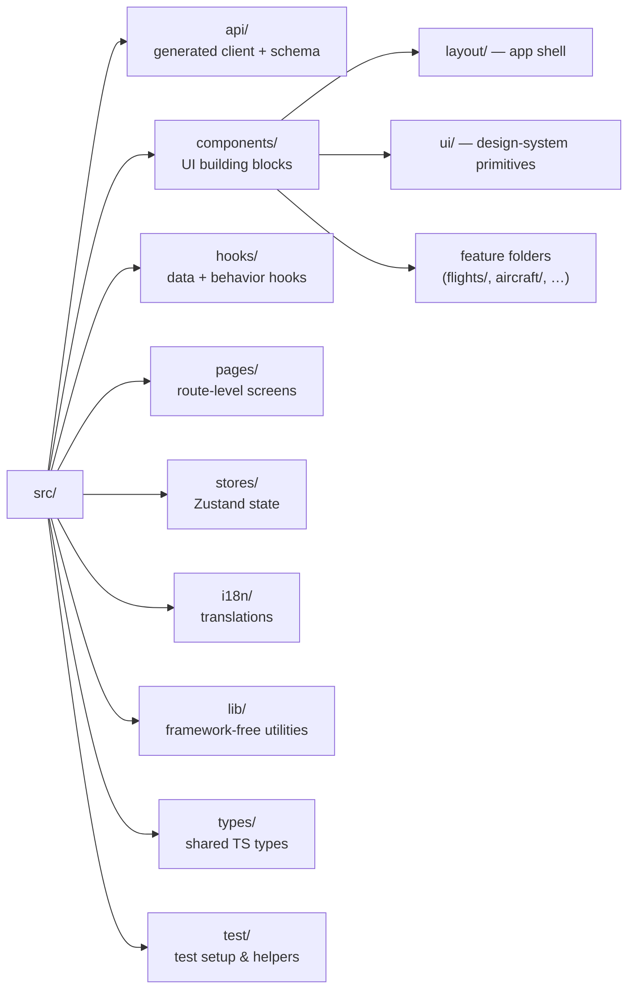

What belongs where:

| Folder | Responsibility | Rule of thumb |
|---|---|---|
| `src/api/` | **Generated** typed client (`client.ts`) and `schema.ts`. | Never edit by hand. Regenerate from the OpenAPI spec. |
| `src/hooks/` | One file per domain (`useFlights`, `useAircraft`, …). Wraps API calls in TanStack Query hooks. | All data access goes through here, not through components. |
| `src/stores/` | Zustand stores for **client-only** state. | Only put state here that has no server counterpart. |
| `src/components/ui/` | Reusable, presentational design-system primitives (`StatCard`, `EmptyState`, `PageWrapper`, …). | No data fetching; props in, markup out. |
| `src/components/layout/` | The app shell: header, sidebar, bottom nav. | The frame every protected page renders inside. |
| `src/components/<feature>/` | Feature-specific components (cards, forms). | Co-locate by domain, e.g. `flights/FlightForm.tsx`. |
| `src/pages/` | Route targets. Compose hooks + components into a screen. | Lazy-loaded in `App.tsx`. |
| `src/lib/` | Pure, framework-agnostic helpers (`cn`, `config`, `duration`, `errors`). | No React, easily unit-testable. |
| `src/i18n/` | i18next init + `locales/<lang>/<namespace>.json`. | Add strings here, not inline. |

The `@` import alias maps to `src/`, so prefer `import { cn } from '@/lib/cn'`
over deep relative paths in new code.

---

## 4. Application Bootstrap & Runtime Flow

`main.tsx` mounts the provider tree; `App.tsx` handles routing and the session
gate. The provider nesting order matters:

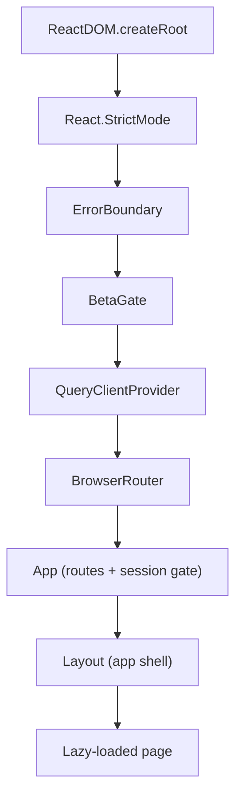

The `QueryClient` is created once in `main.tsx` with app-wide defaults
(`staleTime: 5min`, `retry: 1`, `refetchOnWindowFocus: false`). i18n is imported
**before** `App` so translations are ready on first paint, and `initWebVitals()`
reports Core Web Vitals.

### The cold-start session gate

A PWA launched cold from the home screen must not flash the login page before it
has had a chance to restore the session. `App.tsx` waits for a one-time
`bootstrapPromise` (exported from the API client) to settle before rendering any
protected route.

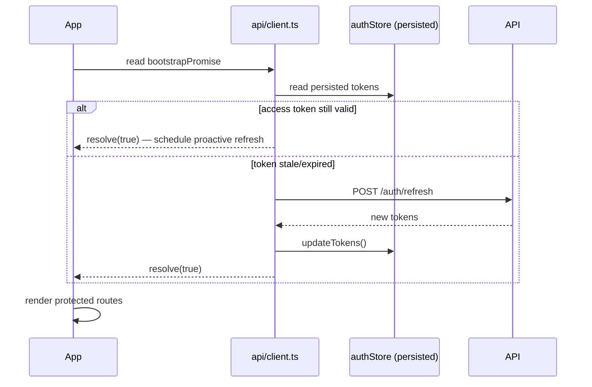

---

## 5. Talking to the API

**Golden rule:** components never call `fetch`/`axios` directly. They call a
**hook** in `src/hooks/`, which calls the **generated typed client** in
`src/api/client.ts`.

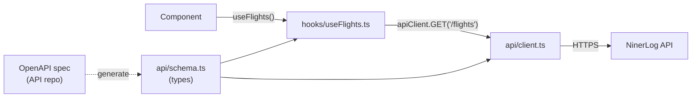

### Generated types & client

`src/api/schema.ts` and the client are produced by
`npm run generate:api` (which runs `scripts/generate-api-client.sh`). Types are
consumed like this:

```ts
import type { components, operations } from '../api/schema';

type Flight        = components['schemas']['Flight'];
type FlightCreate  = components['schemas']['FlightCreate'];
type ListFlightsQ  = operations['listFlights']['parameters']['query'];
```

Because everything is generated from the spec, an API change that breaks a
contract surfaces as a **TypeScript error** at build time rather than a runtime
surprise.

### The auth interceptor

`api/client.ts` registers an `openapi-fetch` middleware that:

- **on request** — waits for the bootstrap refresh, then attaches
  `Authorization: Bearer <accessToken>`.
- **on response** — if a non-auth endpoint returns `401`, performs a **single**
  token refresh (de-duplicated across concurrent requests via a shared
  `refreshPromise`), retries the original request once, and redirects to
  `/login` if the refresh fails.

A proactive timer also refreshes the token ~60s before expiry, and
`visibilitychange` / `online` / `pageshow` listeners refresh a stale token when
the installed PWA is resumed. You generally don't need to touch any of this —
just use the hooks.

### The hook pattern

Every domain hook follows the same shape. Queries return data; mutations
invalidate the caches they affect.

```ts
export const useFlights = (params?: ListFlightsParams) =>
  useQuery({
    queryKey: ['flights', params],
    queryFn: async () => {
      const { data, error } = await apiClient.GET('/flights', {
        params: { query: params || {} },
      });
      if (error) throw error;
      return data as PaginatedFlights;
    },
    placeholderData: keepPreviousData, // smooth pagination
  });

export const useCreateFlight = () => {
  const queryClient = useQueryClient();
  return useMutation({
    mutationFn: async (body: FlightCreate) => {
      const { data, error } = await apiClient.POST('/flights', { body });
      if (error) throw error;
      return data as Flight;
    },
    onSuccess: () => invalidateFlightDependentQueries(queryClient),
  });
};
```

### Cross-cutting cache invalidation

Flights feed statistics, currency, and trends. Rather than remembering every
dependent key, mutations call the shared helper in
[hooks/invalidation.ts](../src/hooks/invalidation.ts):

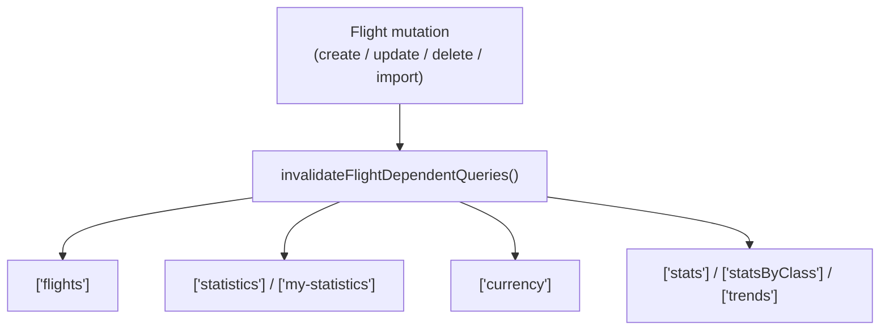

When you add a query whose data derives from flights, **add its key to
`FLIGHT_DEPENDENT_QUERY_KEYS`** so it stays fresh after edits.

---

## 6. State Management

The decision tree for "where does this state go?":

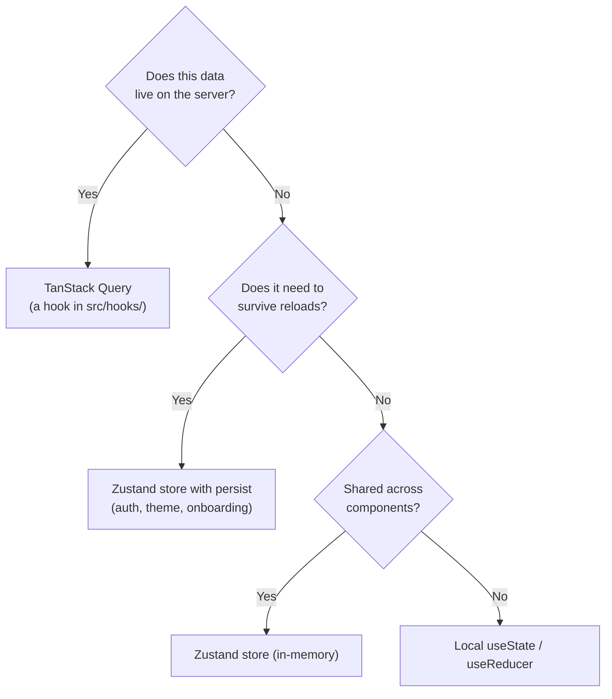

### Zustand stores

| Store | Persisted? | Purpose |
|---|---|---|
| [authStore](../src/stores/authStore.ts) | Yes (`auth-storage`) | Session: user, tokens, `tokenExpiresAt`, `isAuthenticated`. |
| [themeStore](../src/stores/themeStore.ts) | Yes (`ninerlog-theme`) | `light` / `dark` / `system` preference. |
| [onboardingStore](../src/stores/onboardingStore.ts) | Yes | First-run tour state, per user id. |
| [licenseStore](../src/stores/licenseStore.ts) | — | Active license selection. |

Stores are intentionally tiny. The auth store persists the **full session**
(including the access token) so an installed PWA resumes instantly without a
refresh round-trip on every cold launch — a deliberate trade-off documented
inline in [authStore.ts](../src/stores/authStore.ts).

Read store state outside React with `useStore.getState()` and subscribe with
`useStore.subscribe(...)` — the API client uses both to drive token refresh.

---

## 7. The Styling System

Styling is **Tailwind CSS v4, configured entirely in CSS**. There is no
`tailwind.config.js`. Everything lives in
[src/index.css](../src/index.css), organized into layers:

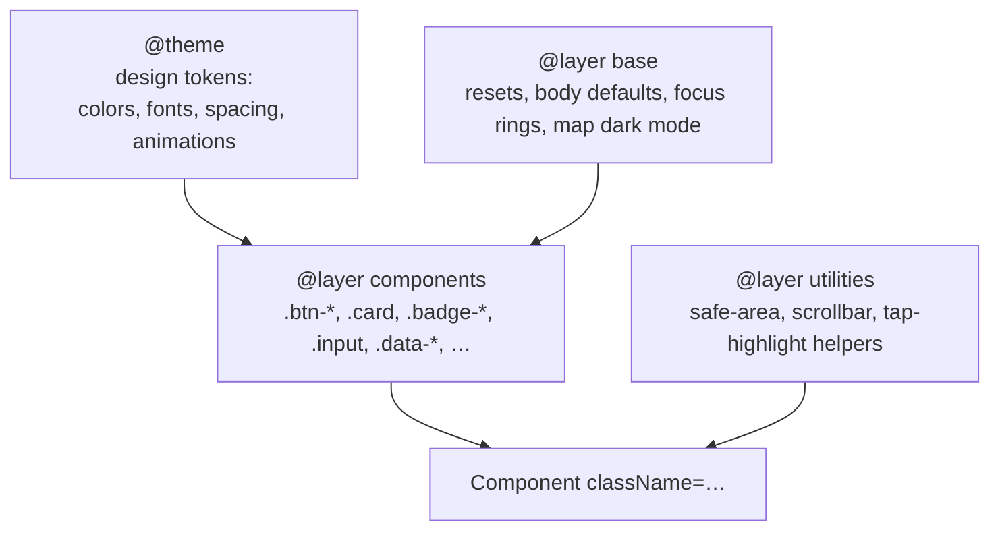

### Design tokens (`@theme`)

Colors are exposed as Tailwind color scales, so `bg-brand-600`,
`text-expired-500`, etc. all work:

| Token family | Meaning |
|---|---|
| `--color-brand-*` / `--color-primary-*` | Aviation blue brand scale (primary is a legacy alias). |
| `--color-current-*` | Green — "current / valid" status. |
| `--color-expiring-*` | Amber — "expiring soon" status. |
| `--color-expired-*` | Red — "expired / invalid" status. |
| `--font-sans` / `--font-mono` | Inter for UI, JetBrains Mono for tabular data. |
| `--spacing-header*`, `--container-*` | Layout rhythm and max-widths. |
| `--animate-*` | Named keyframe animations (`fade-in`, `slide-up`, `sheet-up`). |

### Component classes (`@layer components`)

Common UI is expressed as semantic classes built from `@apply`, so markup stays
short and consistent. Prefer these over re-deriving the same utility chains:

| Class | Use for |
|---|---|
| `.btn-primary` / `.btn-secondary` / `.btn-danger` / `.btn-ghost` (+ `.btn-sm` / `.btn-lg`) | Buttons. |
| `.input` / `.input-error` | Text inputs. |
| `.card` / `.card-hover` | Surfaces. |
| `.badge-current` / `.badge-expiring` / `.badge-expired` / `.badge-info` / `.badge-neutral` | Status pills. |
| `.form-label` / `.form-error` / `.form-helper` | Form field scaffolding. |
| `.page-title` / `.section-title` | Headings. |
| `.data-lg` / `.data-sm` | Monospaced, tabular numeric readouts. |
| `.hover-lift`, `.surface-glass`, `.gradient-brand`, `.hero-greeting`, `.text-gradient-brand` | Polish / brand surfaces. |

### Dark mode

Dark mode is **class-based** (`@custom-variant dark`), toggled by adding `.dark`
to `<html>`. The flow:

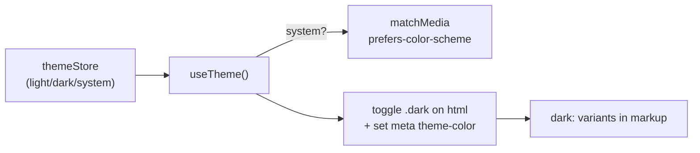

`useTheme()` is called once at the app root, resolves `system` against
`matchMedia`, toggles the class, and updates the mobile browser chrome color. In
markup you just add `dark:` variants (e.g.
`bg-white dark:bg-slate-800`).

### Combining classes — `cn()`

Use the [`cn`](../src/lib/cn.ts) helper (clsx + tailwind-merge) to merge
conditional and overriding classes safely:

```tsx
import { cn } from '@/lib/cn';

<div className={cn('card hover-lift', isActive && 'ring-2 ring-blue-500', className)} />
```

### How to change styles — quick map

| You want to… | Edit |
|---|---|
| Change a brand/status color globally | The relevant `--color-*` token in `@theme` ([index.css](../src/index.css)). |
| Restyle all buttons/cards/badges | The matching class in `@layer components`. |
| Add a new reusable visual treatment | A new class in `@layer components`, then use it in markup. |
| Tweak one component only | `className` on that component (compose with `cn`). |
| Add a new animation | A `@keyframes` + `--animate-*` token in `@theme`. |

---

## 8. Routing & The App Shell

Routes are declared in [App.tsx](../src/App.tsx). Pages are **lazy-loaded** via
`lazyWithRetry` (a wrapper around `React.lazy` that retries a failed chunk load
and falls back to a reload, so a stale PWA deployment never strands the user on a
blank screen).

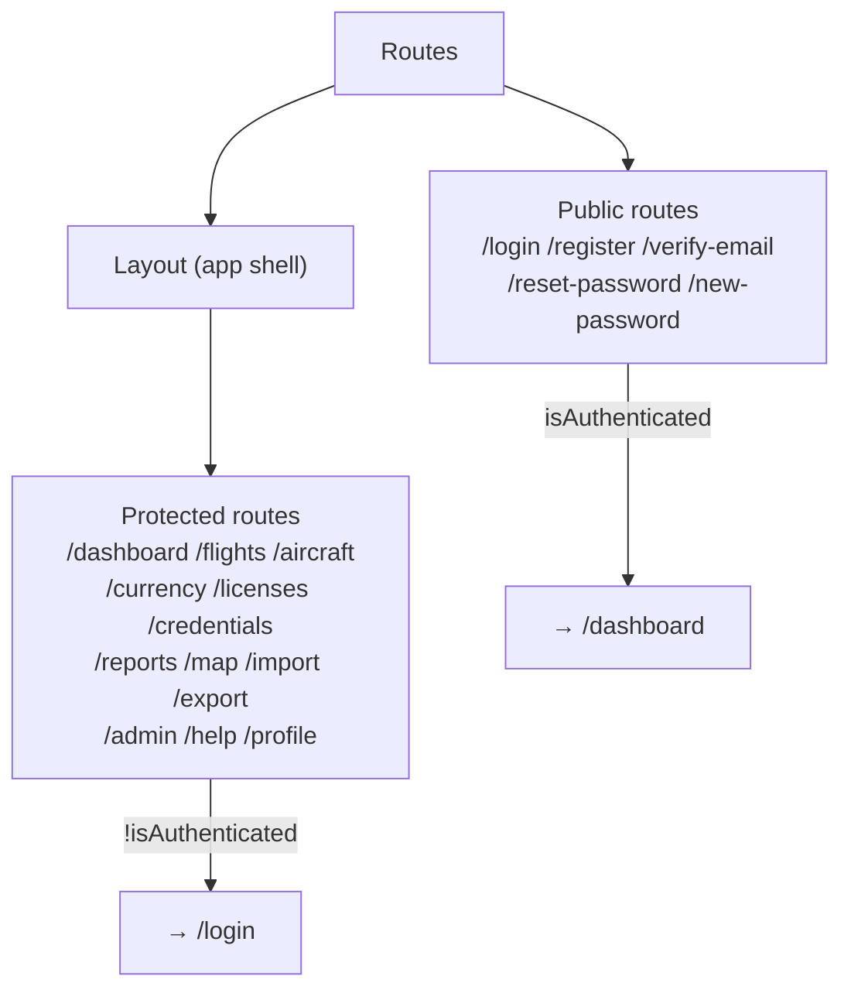

Each protected `<Route>` guards on `isAuthenticated` and redirects to `/login`
otherwise. Protected routes render inside `<Layout>` via an `<Outlet>`.

### The shell

[Layout.tsx](../src/components/layout/Layout.tsx) provides a fixed glass header,
a desktop sidebar (`lg:` and up), and a mobile bottom nav. It also auto-starts
the first-run onboarding tour for brand-new users (no flights logged yet) and
exposes the theme switcher, profile avatar, and logout.

Responsive strategy is **mobile-first**: base styles target phones; `sm:`,
`lg:` breakpoints progressively enhance for larger screens. CSS variables
(`--header-height`, `--bottom-nav-height`) and safe-area utilities
(`pt-safe-top`, `pb-safe`) keep the layout correct around notches.

---

## 9. Internationalization (i18n)

All user-facing text is translated. NinerLog ships **English** and **German**
today. Translations are organized into **namespaces** (one JSON file per feature
area) under `src/i18n/locales/<lang>/`.

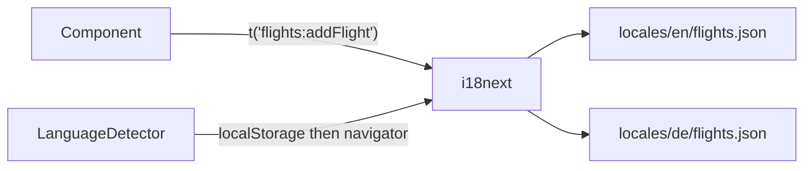

Usage in a component:

```tsx
import { useTranslation } from 'react-i18next';

const { t } = useTranslation('flights');   // pick a namespace
return <button className="btn-primary">{t('addFlight')}</button>;
```

Key rules:

- **Never hard-code display strings.** Add a key to the right namespace JSON for
  **every** supported language.
- The detected language is cached in `localStorage` under `ninerlog-language`;
  fallback is English.
- When you add a namespace, register it in
  [src/i18n/index.ts](../src/i18n/index.ts) (`resources` and the `ns` array).

See [I18N_DEVELOPER_GUIDE.md](./I18N_DEVELOPER_GUIDE.md) and
[TRANSLATION_GUIDE.md](./TRANSLATION_GUIDE.md) for the full workflow.

---

## 10. Recipes — Adding New Things

This section is the practical core: step-by-step recipes for the most common
changes.

### 10.1 Add a new page / route

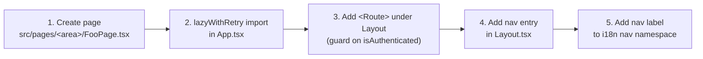

1. **Create the page** under the matching `src/pages/<area>/` folder. Wrap its
   content in `PageWrapper` / `PageHeader` from `components/ui` for consistent
   padding and headings.
2. **Register it** in [App.tsx](../src/App.tsx):
   ```tsx
   const FooPage = lazyWithRetry(() => import('./pages/foo/FooPage'));
   // …inside <Route element={<Layout />}>:
   <Route path="/foo" element={isAuthenticated ? <FooPage /> : <Navigate to="/login" />} />
   ```
3. **Add navigation** in [Layout.tsx](../src/components/layout/Layout.tsx)
   (sidebar `SidebarItem` and/or bottom nav) with a `lucide-react` icon.
4. **Add the nav label** to `src/i18n/locales/<lang>/nav.json` for every language.

### 10.2 Add a new API-backed data hook

1. Make sure the endpoint exists in the generated `schema.ts` (regenerate with
   `npm run generate:api` if the API changed).
2. Create or extend a file in `src/hooks/` following the query/mutation pattern
   in [Talking to the API](#5-talking-to-the-api).
3. Pick a stable, structured `queryKey` (e.g. `['foo', params]`).
4. In mutations, invalidate the affected keys in `onSuccess`. If the data
   derives from flights, reuse `invalidateFlightDependentQueries`.

### 10.3 Add a form

Forms use **React Hook Form + Zod**. Define a schema, infer the type, wire it
with `zodResolver`, and submit through a mutation hook.

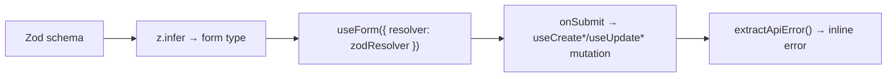

```tsx
const schema = z.object({
  name: z.string().min(1, 'Required'),
  hours: z.number().min(0),
});
type FormData = z.infer<typeof schema>;

const { register, handleSubmit, formState: { errors } } =
  useForm<FormData>({ resolver: zodResolver(schema) });

const create = useCreateThing();
const onSubmit = handleSubmit(async (values) => {
  try { await create.mutateAsync(values); onClose(); }
  catch (e) { setApiError(extractApiError(e)); }
});
```

Style fields with `.input` / `.input-error`, labels with `.form-label`, and
errors with `.form-error`. See
[FlightForm.tsx](../src/components/flights/FlightForm.tsx) for a full-featured
example (autocomplete, collapsible sections, quick-add).

### 10.4 Add a reusable UI primitive

1. Create the component in `src/components/ui/` — presentational only, no data
   fetching. Accept a `className` prop and merge it with `cn`.
2. Compose existing design-system classes rather than new ad-hoc styles.
3. Export it from [components/ui/index.ts](../src/components/ui/index.ts) for a
   tidy import surface.

### 10.5 Add or change a color / status token

Edit the relevant `--color-*` token in the `@theme` block of
[index.css](../src/index.css). It immediately becomes available as Tailwind
utilities (`bg-<name>-500`, `text-<name>-600`, …) and via any `@layer
components` class that references it.

---

## 11. Testing

Three layers, each with a clear job:

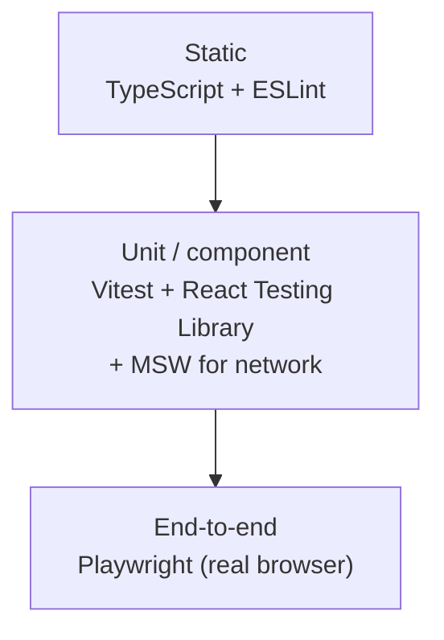

| Command | What it runs |
|---|---|
| `npm test` | Vitest unit/component tests (happy-dom env, setup in `src/test/`). |
| `npm run test:ui` | Vitest in watch UI mode. |
| `npm run test:e2e` | Playwright E2E suite. |
| `npm run type-check` | `tsc --noEmit`. |
| `npm run lint` / `lint:fix` | ESLint. |

- **Unit/component** tests render components with RTL and mock the network with
  **MSW**, so tests exercise the real hooks and client without a live API.
- **E2E** tests drive a real browser through full user journeys.

Before committing or pushing, run the unit tests, the E2E suite, type-check, and
lint. See [TESTING.md](./TESTING.md) for details and patterns.

---

## 12. Tooling, Quality Gates & Conventions

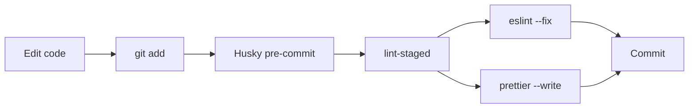

- **Husky + lint-staged** run ESLint and Prettier on staged files at commit
  time (`*.{ts,tsx}` → lint + format; `*.{css,md,json}` → format).
- **Prettier** owns formatting — don't fight it manually.
- **TypeScript is strict** — prefer generated types from `schema.ts` over `any`.
  The few `as any` casts in mutation bodies are deliberate seams against the
  generated client and should not be copied gratuitously.
- **Path alias:** import from `@/…` (maps to `src/`) in new code.
- **Runtime config:** environment values come from
  [lib/config.ts](../src/lib/config.ts), which prefers runtime `window.ENV`
  (injected by the Docker entrypoint) over Vite build-time env, so a single
  build runs in any environment.

### Conventions checklist for a new feature

- [ ] Data access lives in a `src/hooks/` hook, not in the component.
- [ ] Mutations invalidate the right query keys on success.
- [ ] All user-facing text goes through `t()` and exists in **every** locale.
- [ ] Styling reuses design tokens / `@layer components` classes; new shared
      styles are added there, not inline.
- [ ] New routes are lazy-loaded and auth-guarded.
- [ ] `npm run type-check`, `npm run lint`, and tests pass before pushing.

---

## Related Documents

- [README.md](../README.md) — quick start, scripts, project structure overview.
- [TESTING.md](./TESTING.md) — testing strategy and patterns.
- [I18N_DEVELOPER_GUIDE.md](./I18N_DEVELOPER_GUIDE.md) — adding translatable strings.
- [TRANSLATION_GUIDE.md](./TRANSLATION_GUIDE.md) — contributing translations.
- [IMPLEMENTATION.md](../IMPLEMENTATION.md) — feature summary & architecture decisions.
